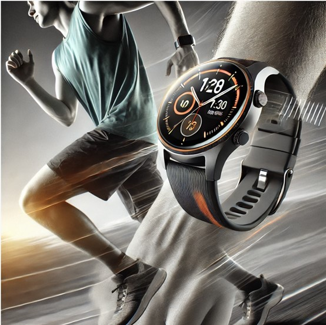
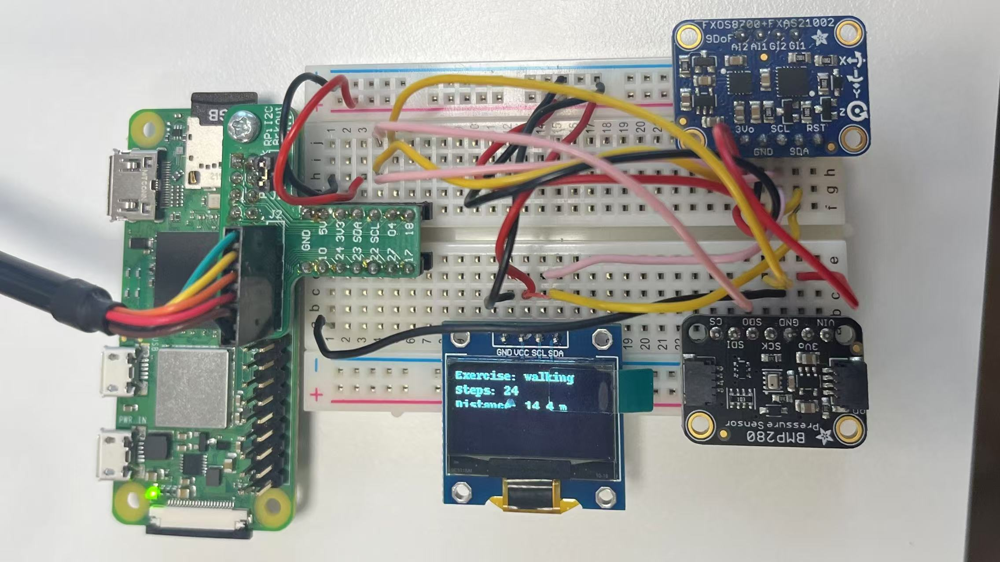

<link rel="stylesheet" href="style.css">

# Smart Fitness Watch | Secure, Accurate, and Personalized for You
The **ultimate smart fitness watch** that keeps track of your workouts and environment, helping you stay **healthy and active**.

## Accurate Monitoring for Smarter Workouts
Put on the smart sports watch and enhance every workout. Equipped with advanced sensors, it continuously monitors **altitude, air quality, humidity, body temperature, and ambient temperature**, ensuring you stay informed about both your environment and physical condition. With an intelligent algorithm, measurements are more precise, providing professional support for your health and fitness.

## High-Definition Display for Quick Insights
A clear and intuitive display interface ensures that key workout data stands out. **The watch’s core functions are highlighted while other elements fade into the background**, allowing you to focus on the most important information. No need to fumble for stats while running—your vital data is always within view, empowering you to push your limits.

## Private Database, Secure and Encrypted
Each registered user has access to a **personalized fitness database**, where all historical data and account information are encrypted for maximum security. Your workout records **sync automatically**, allowing you to track progress anytime and refine your training plan.

## Watch the Video
<iframe width="560" height="315" src="https://www.youtube.com/test" frameborder="0" allowfullscreen></iframe>

# More Details!

- We have screen to display and working mode to choose

## Multiple Workout Modes, Accurate Tracking
The smart watch supports various exercise modes, allowing users to switch between them effortlessly:

- Walking – Tracks steps, distance, and energy expenditure.
- Running – Monitors speed, movement intensity, and calories burned.
- Jump Rope – Counts jumps, rhythm, and workout duration.
- Stair Climbing – Measures climbing height, stride, and time spent.
All workout data is stored in real-time, enabling users to analyze their performance and optimize training strategies.

## Intelligent Environmental Monitoring for Safer Workouts
Equipped with temperature, humidity, and CO₂ sensors, the watch evaluates environmental conditions and provides smart exercise recommendations:

- Extreme temperatures – Alerts users if the weather is too hot or cold for safe exercise.
- Air quality analysis – Uses CO₂ sensors to assess air quality, advising whether outdoor workouts are safe.
- Humidity monitoring – Detects high humidity levels to help users adjust workout intensity accordingly.

## Data Visualization for Smarter Training
All fitness data is automatically recorded, allowing users to review past activities and gain deeper insights through visualized analytics:

- Workout duration and activity breakdown.
- Performance comparisons across different workout modes.
- Long-term trend analysis to refine fitness plans.

## Why Choose Smart Fitness Watch?
**Track Your Performance** – Get insights on your workout, steps, distance, and calories burned.  
**Monitor Your Surroundings** – Temperature, humidity, and air quality sensors ensure you breathe clean air.  

## Your Fitness Data, Smarter Than Ever
The smart sports watch is **not just a fitness assistant—it’s your personal health guardian**. With precise monitoring, intelligent analysis, and future-proof expandability, it elevates your workout experience to the next level. Wear it now and step into a smarter, more scientific way of training!

## Future Prospects: Expanding Functionality Beyond the Watch
While the current smart sports watch already offers comprehensive monitoring and analysis, future innovations will further enhance its adaptability across various sports and environments. Potential expansions include:

- Smart Gloves – Designed with built-in temperature sensors to monitor hand temperature, ideal for extreme sports and cold environments.
- Smart Helmet – Equipped with an embedded speed measurement module for real-time speed tracking in activities like cycling and skiing.
- Smart Glasses – Featuring an integrated laser rangefinder to measure distances in outdoor sports, improving spatial awareness.

These future developments aim to bring more intelligent and customized sports solutions, expanding the possibilities of wearable fitness technology.

## 📥 Get Yours Today!
👉 **[Order Now](#)** | 📱 **[Download the App](#)**  
